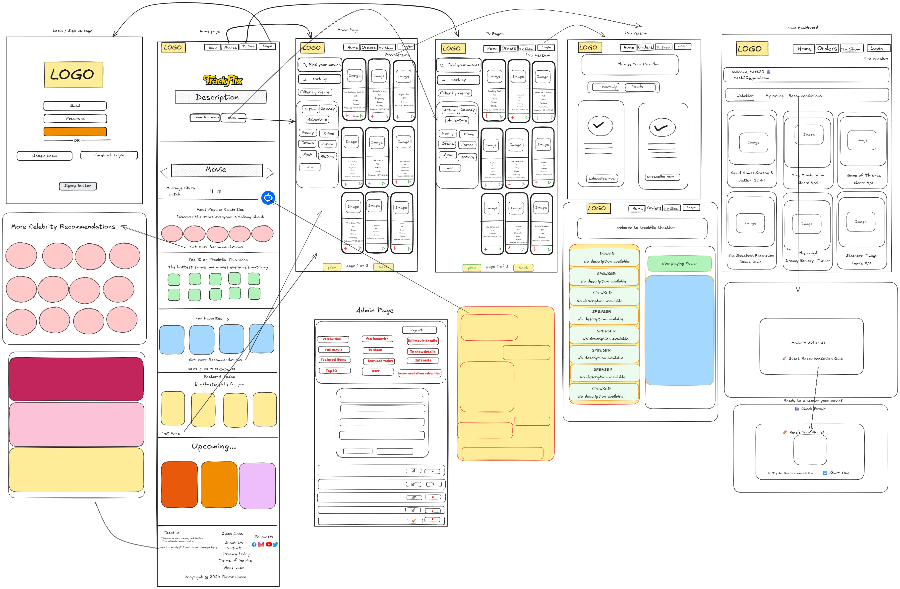

#  TrackFlix

TrackFlix is a movie and TV show discovery platform where users can explore trending movies, upcoming releases, fan favorites, and top celebrities. With personalized watchlists, recommendations, and a built-in movie chatbot, TrackFlix is your ultimate entertainment hub!  

---

##  Features

###  Explore Movies & TV Shows
- View **Top 10 Movies** of the week  
- Discover **Upcoming Movies**  
- Browse **Fan-Favorite Movies**  
- Check out **Top Celebrity Popular Movies**  
- Two dedicated sections:  
  -  **Movie Page**  
  -  **TV Show Page**

###  Movie Details
- Movie cards with **ratings** and **trailers**  
- Add movies to a **personal watchlist** (requires login)  
- Personalized **recommendation page**: answer some fun questions and get a movie suggestion  

###  User Features
- **Login/Register** system  
- Create and manage your **own watchlist**  
- Access the **recommendation system**  

###  Pro Version (Mock Payment System)
- Unlock premium features with mock payments via **Bkash**, **Nagad**, or **Credit/Debit Card**  
- Includes **mock OTP verification**  
- Access **exclusive movie list & watch option**  

###  Admin Dashboard
- Add, update, or delete movies and shows  
- Manage platform content easily  

###  Movie Chatbot
- Integrated **chatbot on the home page**  
- Ask anything about movies and get instant answers  

---

##  Tech Stack
- **Frontend**: React.js , Tailwind CSS  
- **Backend**: Node.js / Express.js  
- **Database**: MongoDB / MySQL  
- **Authentication**: J Firebase Auth  
- **Payment Mock**: Custom logic for Bkash, Nagad, Card  
- **Chatbot**: Rule-based + API-driven 

---
## App Version

The latest version of the app has been improved. You can download and install it via Android Studio using the link below:

[Download App](https://drive.google.com/file/d/1EIqhCJTaYMaBRM09CRKo4vt_uS2s91er/view?usp=sharing)

-

##  Installation & Setup

```bash
# Clone the repository
git clone https://github.com/RoBiul-Hasan-Jisan/4loopers.git

# Navigate into project directory
cd trackflix

# Install dependencies
npm install

# Start development server
npm run dev

```
## 🎨 Wireframing  

If you’re interested in the full wireframe, check it out here:  
🔗 [View Wireframe on Excalidraw](https://excalidraw.com/#json=cvyT0a-W30exJZns9NhNa,xXMpZg7vgjWzpq3ncCbukw)  

Here’s a quick screenshot preview:  


## Schema 


##  Screenshots

  
  
  
  
  
  
  


##  Documentation
[API Documentation](https://drive.google.com/file/d/1Lws0YKAKssYH4wS8kvJCx8HYHZfNa3Vv/view?usp=sharing)

[Project Documentation](https://drive.google.com/file/d/1QWdF-O_mbwETzS7B59SFguSy1OpJ6FGh/view?usp=sharing)


## Software Architecture

The software architecture of **TrackFlix** is divided into three main layers: Frontend, Backend, and Database, along with user interactions and optional data relationships.
### Full Database Diagram
.svg)

### Architecture Diagram

.svg)

### Layers Overview

#### Frontend Layer
- Built with **React.js** and **Tailwind CSS**
- Handles user interactions and API requests to backend

#### Backend Layer
- **Node.js** + **Express.js**
- Handles:
  - Authentication (Firebase)
  - Movie/TV CRUD operations
  - Recommendations
  - Mock Payments
  - Chatbot API integration

#### Database Layer
- **MongoDB**: Users, Watchlist, Movies, FullMovieDetails, Live Shows, Celebrities, Awards, Recommendations, Top10Movies
- **MySQL**: Payment transactions (mock)

#### User Interactions
- Users interact with the **Frontend**, which communicates with the **Backend**
- Backend manages data in databases and interacts with external services like FirebaseAuth and Chatbot APIs

#### Optional Data Relationships
- Watchlist contains Movies, FullMovieDetails, Live Shows, Live TV Shows
- Can also include FanFavorites and Interests


## project structure 
 ```bash

  4loopers/  
│── public/
│   └── images/               # Static assets
│
├── trackflix-backend/        # Backend (Node.js + Express + MongoDB)
│   ├── config/               # Database & server config
│   ├── data/                 # Data utilities
│   ├── dump/                 # Database dump
│   ├── models/               # Mongoose models
│   ├── routes/               # Express routes
│   ├── importAllData.js      # Data seeding script
│   ├── server.js             # Main backend entry point
│   ├── package.json
│   └── .env
│
├── trackflix-frontend/       # Frontend (React + Vite + Tailwind CSS)
│   ├── src/
│   │   ├── animations/       # Animations and Lottie files
│   │   ├── api/              # API calls
│   │   ├── assets/           # Static assets
│   │   ├── chatbot/          # Chatbot feature
│   │   ├── components/       # Reusable UI components
│   │   ├── constants/        # Constant values
│   │   ├── context/          # React Context API
│   │   ├── data/             # Static data
│   │   ├── firebase/         # Firebase config
│   │   ├── hooks/            # Custom React hooks
│   │   ├── pages/            # Main pages
│   │   ├── ProVersion/       # Premium/Pro features
│   │   ├── RecommendationPage/ # Recommendation engine UI
│   │   ├── userdeshbord/     # User dashboard
│   │   └── utils/            # Helper functions
│   ├── App.jsx
│   ├── main.jsx
│   ├── index.css
│   ├── package.json
│   └── .env
│
├── README.md
└── LICENSE
```


##  Future Improvements

- AI-based movie recommendation system

- Real payment gateway integration

- Multi-language support

- Mobile app version

##  Contributing

Contributions are what make the open-source community such an amazing place to **learn, inspire, and create**. Any contributions you make are greatly appreciated.

If you have suggestions for **adding or removing features**, feel free to:

- Open an **issue** to discuss your idea, or  
- Directly create a **pull request** with the necessary changes.

>  Please create **individual PRs** for each suggestion or feature.


##  Authors

- [**Robiul Hasan Jisan**](https://portfolio-nine-gilt-93.vercel.app/)
- **Intesar Hossain**  
- **Md Abrar Hossain**  
- **Ramisa Mahi**  


  


